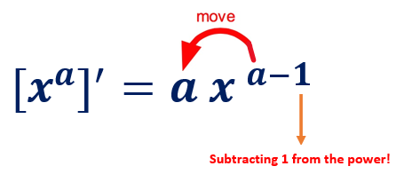

```{=html}

<style type="text/css">

/* Cascading Style Sheets (CSS) is a stylesheet language used to describe the presentation of a document written in HTML or XML. it is a simple mechanism for adding style (e.g., fonts, colors, spacing) to Web documents. */

h1.title {  /* Title - font specifications of the report title */
  font-size: 24px;
  color: DarkRed;
  text-align: center;
  font-family: "Gill Sans", sans-serif;
}
h4.author { /* Header 4 - font specifications for authors  */
  font-size: 20px;
  font-family: system-ui;
  color: DarkRed;
  text-align: center;
}
h4.date { /* Header 4 - font specifications for the date  */
  font-size: 18px;
  font-family: system-ui;
  color: DarkBlue;
  text-align: center;
}
h1 { /* Header 1 - font specifications for level 1 section title  */
    font-size: 22px;
    font-family: "Times New Roman", Times, serif;
    color: navy;
    text-align: center;
}
h2 { /* Header 2 - font specifications for level 2 section title */
    font-size: 20px;
    font-family: "Times New Roman", Times, serif;
    color: navy;
    text-align: left;
}

h3 { /* Header 3 - font specifications of level 3 section title  */
    font-size: 18px;
    font-family: "Times New Roman", Times, serif;
    color: navy;
    text-align: left;
}

h4 { /* Header 4 - font specifications of level 4 section title  */
    font-size: 18px;
    font-family: "Times New Roman", Times, serif;
    color: darkred;
    text-align: left;
}

body { background-color:white; }

.highlightme { background-color:yellow; }

p { background-color:white; }

</style>
```
```{r setup, include=FALSE}
# Detect, install and load packages if needed.
if (!require("knitr")) {
   install.packages("knitr")
   library(knitr)
}
if (!require("leaflet")) {
   install.packages("leaflet")
   library(leaflet)
}
if (!require("EnvStats")) {
   install.packages("EnvStats")
   library(EnvStats)
}
if (!require("MASS")) {
   install.packages("MASS")
   library(MASS)
}
if (!require("phytools")) {
   install.packages("phytools")
   library(phytools)
}
#
# specifications of outputs of code in code chunks
knitr::opts_chunk$set(echo = FALSE,      # include code chunk in the output file
                      warnings = FALSE,  # sometimes, you code may produce warning messages,
                                         # you can choose to include the warning messages in
                                         # the output file. 
                      messages = FALSE,  #
                      results = TRUE     # you can also decide whether to include the output
                                         # in the output file.
                      )   
```

\

# Review: Concepts of Limits

We have described how to find the limit of a function at a given point graphically. Next we introduce how to find limit algebraically. The basic method is **substitution**. The following <font color = "red"> **\color{red}updated chart**</font> outlines the workflow in calculating the limit of a given function at a given value of the independent variable.

```{r echo=FALSE, fig.align ="center",  out.width = '85%'}
include_graphics("img/w01-CalculateLimit.png")
```

\

Recall that when left and right limits are not equal or at least one of one-sided limits is equal to $\infty$ or $-\infty$, we call the limit does not exist. As an exercise, find $x$ values at which the limit does not exist.


```{r echo=FALSE, fig.align ="center",  out.width = '75%'}
include_graphics("img/w02note-limitDoesNotExist.png")
```

**Answer**: $x = -0, 2, 5$


\

# Properties of Limits

## Sum Rule

This rule states that the limit of the sum of two functions is equal to the sum of their limits: 
$$
\lim_{x\to a}[f_1(x) + f_2(x) ] = \lim_{x\to a}f_1(x) + \lim_{x\to a}f_2(x).
$$

## Constant Function Rule

The limit of a constant function is the constant: $$\lim_{x\to a} C = C.$$

## Constant Multiple Rule

The limit of constant times a function is equal to the product of the constant and the limit of the function: $$
\lim_{x\to a}Cf(x) = k\lim_{x\to a}f(x).
$$

## Product Rule

This rule says that the limit of the product of two functions is the product of their limits (if they exist): $$
\lim_{x\to a}[f_1(x)f_2(x)] = \lim_{x\to a}f_1(x)\lim_{x\to a}f(x)
$$

## Quotient Rule

The limit of the quotient of two functions is the quotient of their limits, provided that the limit in the denominator function is not zero: 
$$
\lim_{x\to a}\frac{f(x)}{g(x)} = \frac{\lim_{x\to a}f(x)}{\lim_{x\to a}g(x)}.
$$

## Power Rule

For any real number $p$, 
$$
\lim_{x\to a}[f(x)]^p = [\lim_{x\to a}f(x)]^p.
$$ 
In particular, 


$$
\lim_{x\to a}\sqrt[p]{f(x)} = \sqrt[p]{\lim_{x\to a}f(x)}.
$$

## Algebraic Calculation of Limits by Examples

**Example 1**: Compute the value of the following limit 
$$
\lim_{x\to -2}(3x^2 + 5x -9).
$$

**Solution**: 

$$
\lim_{x\to -2}(3x^2 + 5x -9) = 3[\lim_{x\to -2} x]^2 + 5\lim_{x\to -2}x - \lim_{x\to -2}9 = 3\times (-2)^2 + 5(-2) - 9 = -7.
$$

**Example 2**: Evaluate the following limit. 

$$
\lim_{x\to 1}\frac{6-3x+10x^2}{-2x^4+7x^3+1}.
$$ 
**Solution**: Using properties of limit, we have 

$$
\lim_{x\to 1}\frac{6-3x+10x^2}{-2x^4+7x^3+1}=\frac{\lim_{x\to 1}[6-3x+10x^2]}{\lim_{x\to 1}[-2x^4+7x^3+1]}=\frac{6-3(1)+10(1)^2}{-2(1)^4+7(1)^3+1}=\frac{13}{6}.
$$

**Example 3** Find the limit 

$$
\lim_{x\to 9}\frac{4x^2}{1+\sqrt{x}}.
$$

**Solution**: Using the properties of limits (the sum rule, the power rule, and the quotient rule), we get $$
\lim_{x\to 9}\frac{4x^2}{1+\sqrt{x}}=\frac{\lim_{x\to 9}(4x^2)}{\lim_{x\to 9}(1+\sqrt{x})} = \frac{4\lim_{x\to 9}(x^2)}{(\lim_{x\to 9}1+\lim_{x\to 9}\sqrt{x})} = \frac{4\times 9^2}{(1+\sqrt{9})} = 81.
$$

**Example 4**: Suppose that $\lim_{x\to 1}f(x) = 2$ and $\lim_{x \to 1}g(x) = 3$. Calculate the limit 
$$
 \frac{g(x) - 3f(x)}{f^2(x) + g(x)}
 $$

**Solution**: Using the properties of limit, we have 
$$
\lim_{x\to 1} \frac{g(x) - 3f(x)}{f^2(x) + g(x)} =  \frac{\lim_{x\to 1}[g(x) - 3f(x)]}{\lim_{x\to 1}[f^2(x) + g(x)]} = \frac{\lim_{x\to 1}g(x) - 3\lim_{x\to 1}f(x)}{[\lim_{x\to 1}f(x)]^2 + \lim_{x\to 1}g(x)} = -\frac{3}{7}.
$$

\

# Average Rate of Change.

Often times we are not just interested in a function $f(x)$ itself but also in how $f(x)$ changes. To be specific, we may be interested in how much the function changed per unit, on average, over an interval.

## Average rate of change of a function over an interval

**Average rate of change of a function** $f(x)$ over an interval [$a, b$] for $a \ne b$ is defined to be $$
\frac{f(b)-f(a)}{b-a}
$$ The geometric interpretation of the average rate of change is the slope of the secant line defined based on the interval.

```{r echo=FALSE, fig.align ="center",  out.width = '45%'}

```

**Example**: According to Google Maps, it's about 33 miles from WCU to the Independent Hall in Philadelphia. If Kevin made this trip in 45 minutes, what was his average rate of travel during the trip?

```{r echo=FALSE, fig.align ="center",  out.width = '65%'}
include_graphics("img/w01note17-RateChangeDistance.png")
```

**Solution**: Let $t$ be the driving time and $f(t)$ the driving distance (that is a function of time $t$). We set $t=0$ at the starting point, i.e., $f(0)=0$. Since it takes 0.75 hours to drive to the destination, this means $f(0.75) = 33$. Now based on the definition of **the rate of change of the distance function** $f(t)$ on interval $[0, 0.75]$, we have $$
V = \frac{f(0.75) - f(0)}{0.75-0} = \frac{33-0}{0.75-0} = \frac{33}{0.75} = 44.
$$ The rate of change is 44 miles per hour.

**Example**: In 1998, Linda purchased a house for \$144,000. In 2009, the house was worth \$245,000. Find the average annual rate of change in dollars per year in the value of the house. Round your answer to the nearest dollar.

**Solution**: Since house prices ($P$) change over time ($t$), therefore, house price is a function of time $P(t)$. The objective is to find the annual rate of change of the house price. It is natural to use the year as the time variable $t$ and set $f(1998) = 144000$ and $f(2009) = 245000$. Then the annual rate of change is $$
\frac{f(2009) - f(1998)}{2009 - 1998} = \frac{245000-144000}{2009-1998} \approx 9182.
$$ 

The annual rate of change is approximately equal to \$9182.


\


# Definition of Derivative

We know that the average of change of a function at $P(x_1, y_1)$ and $Q(x_2, y_2)$ represents the slope of secant line of the line passing through points $P$ and $Q$. This section discuss the concepts of derivative. Before we introduce the definition of derivative, we need a few related concepts.

When $Q(x_2, y_2)$ moves to $P(x_1, x_2)$, the secant line eventually becomes the tangent line at $P(x_1, y_1)$. This limiting process is demonstrated in the following animated graph.

\

```{r echo=FALSE, fig.align ="center",  out.width = '65%'}
if (knitr:::is_latex_output()) {
  knitr::asis_output('\\url{https://github.com/pengdsci/MAT143/raw/main/w02/img/w02-SecantTangentSlopes.gif}')
} else {
  knitr::include_graphics("img/w02-SecantTangentSlopes.gif")
}
```


## Difference quotient

The difference quotient of a (single variable) function is usually the name for the following expression 

$$
\frac{f(x+h)-f(x)}{h}.
$$ 

This is a variation of the formula of the rate of change 

Recall that the average rate of change of a function at two points $P(a,f(a))$ and $Q(b, f(b))$ is given by


$$
\frac{f(b)-f(a)}{b -a}.
$$ 

If we denote $x = a$ and $h = b-a$, the coordinates of $P$ and $Q$ can be re-expressed as $P(x, f(x))$ and $Q(a+h, f(a+b))$. The corresponding rate of change can be re-written as

$$
\frac{f(x+h)-f(x)}{(x+h) - x} = \frac{f(x+h)-f(x)}{h}.
$$ 

The above notation is called the **difference quotient**. In general, $h$ is distance between points $P$ and $Q$. $h \to 0$ implies that $Q$ moves to $P$.


```{r echo=FALSE, fig.align ="center",  out.width = '65%'}
include_graphics("img/w02note-DifferenceQuotient.png")
```

With the above notation, we can find the **difference quotient** for a function with explicit expression. Next are few examples.


\

**Example 1**: Find the difference quotient of $f(x) = x^2 + 4x -6$.

**Solution**: Using the definition of the difference of quotient, we have 
$$
\frac{f(x+h)-f(x)}{h} = \frac{[(x+h)^2 + 4(x+h) -6]-[x^2+4x-6]}{h}=\frac{2hx+h^2+4h}{h}=2x+h+4.
$$

\

**Example 2**: Find the difference quotient of $f(x) = \sqrt{x}$.

**Solution**: Using the formula of the difference quotient, we have 
$$
\frac{\sqrt{x+h}-\sqrt{x}}{h} = \frac{(\sqrt{x+h}-\sqrt{x})(\sqrt{x+h}+\sqrt{x})}{h(\sqrt{x+h}-\sqrt{x})} = \frac{(x+h)-x}{{h(\sqrt{x+h}+\sqrt{x})}} = \frac{1}{\sqrt{x+h}+\sqrt{x}}.
$$


\


## Instantaneous Rate of Change: Derivative

The slope of the tangent line the passes $P(c, f(c))$ and $Q(c+h, f(c+h))$ is given by
$$
\frac{f(c+h) - f(c)}{h}.
$$

The limit of the above **difference quotient** when $t \to 0$ is the slope of the tangent line at $P$. 
$$
\text{Slope of the tangent line at P} = \lim_{h \to 0} \frac{f(c+h) - f(c)}{h}
$$

\

```{r echo=FALSE, fig.align ="center",  out.width = '65%'}
if (knitr:::is_latex_output()) {
  knitr::asis_output('\\url{https://github.com/pengdsci/MAT143/raw/main/w02/img/w02-derivative.gif}')
} else {
  knitr::include_graphics("img/w02-derivative.gif")
}
```

**Definition**: The derivative of $f(x)$ at $x = c$ is defined to be the slope of the tangent line at $P(c, f(c))$. We use notation $f^\prime(c)$ is used to denote the derivative of $f(x)$ at $x = c$. 


**Definition**: If the derivative of $f(x)$ exists at $x = c$, we also call that $f(x)$ is differential at $x = c$. 

\

## Finding Derivatives

Since the derivative of a function at a given point $x = c$ is the limit of the **difference quotient** of the function at $x = c$. This means, to calculate the derivative of a function, we need to find the **difference quotient** first, then take the limit at $h = 0$.

**Example 3**: find the derivative of $f(x) = 5$.

**Solution**: The **difference quotient** of $f(x) = 5$ is 
$$
\frac{f(x+h) - f(x)}{h} = \frac{(5) - 5}{h} = \frac{5-5}{h} = 0.
$$
Therefore,
$$
f^\prime(x) = (5)^\prime = 0.
$$

\

**Example 4**: find the derive of $f(x) = x^2$.

**Solution**. We first find the **difference quotient**.

$$
\frac{f(x+h)-f(x)}{h} = \frac{(x+h)^2-x^2}{h} = \frac{(x^2+2hx+h^2)-x^2}{h} = \frac{2hx+h^2}{h} =2x+h 
$$
By definition,
$$
f^\prime(x) = \lim_{h \to 0} (2x +h) = 2x + \lim_{h \to 0}(h) = 2x.
$$

\

**Example 5**: Find the derivative of $f(x) = \sqrt{x}$.

**Solution**: The **Difference quotient** of $f(x) = \sqrt{x}$ is given by

$$
\frac{f(x+h) - f(x)}{h} = \frac{\sqrt{x+h})-\sqrt{x}}{h} = \frac{(\sqrt{x+h}-\sqrt{x})(\sqrt{x+h}+\sqrt{x})}{h(\sqrt{x+h}+\sqrt{x})} = \frac{1}{\sqrt{x+h}+\sqrt{x}}
$$
Therefore,
$$
f^\prime(x) = \lim_{h \to 0}\frac{1}{\sqrt{x+h}+\sqrt{x}} = \frac{1}{2\sqrt{x}}
$$

\

# Basic Rules of Derivatives - Part I.

For convenience, we first introduce some basic rules of derivative before calculating the derivative of functions with more complex forms.

## Power Rule

Recall that the Power function is defined by

$$
f(x) = x^n
$$

Where the power $n$ is an arbitrary real number. The derivative of the function is defined to be

```{r echo=FALSE, fig.align ="center",  out.width = '45%'}

```

Next, we use the above power rule to do a few examples.Some of the functions are not in the standard form of the power function, but we can re-express it into the standard form. For example, $f(x) = 1/\sqrt{x} = x^{1/2}$, $f(x) = 1/x = x^{-1}$, etc.

**Example 6**: Find the derive of $f(x) = 1/\sqrt[5]{x^2}$.

**Solution**: We first re-express the given function in the the standard form of power function and then take the derivative using the power rule.

$$
f^\prime(x) = (1/\sqrt[5]{x^2})^\prime = \left( x^{-2/5}\right)^\prime = (-2/5)x^{-2/5 - 1} = -\frac{2}{5}x^{-7/5}.
$$


## Additive Rule

The additive rule deals with the derivative of the sum of functions. To be more specific,

**Additive Rule**: Let $f(x)$ and $g(x)$ be two *differentiable* functions (that have derivatives (i.e., the derivative of both functions exist). Then
$$
[f(x) + g(x)]^\prime = f^\prime(x) + g^\prime(x).
$$

Next, we use the additive rule to find the derivative of function with more complex forms.


**Example 7**: Find the derivative of $f(x) = 5 + x^3$.

**Solution**: Using the additive and power rule, we have
$$
f^\prime(x) = (5 + x^3)^\prime = (5)^\prime + (x^3)^\prime = 0 + 3x^{3-1} = 3x^2.
$$


**Example 8**: Find the derivative of $f(x) = x + \sqrt{x}$

**Solution**: We first express each term into power function then take derivative

$$
f^\prime(x) = (x + \sqrt{x})^\prime = (x^1)^\prime + (x^{1/2})^\prime = 1x^{1-1} + (1/2)x^{1/2-1} = 1 + \frac{1}{2\sqrt{x}}.
$$


